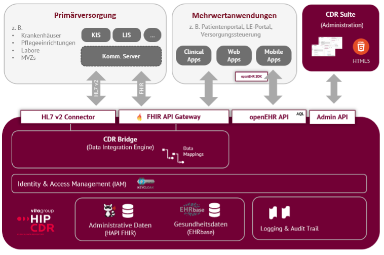
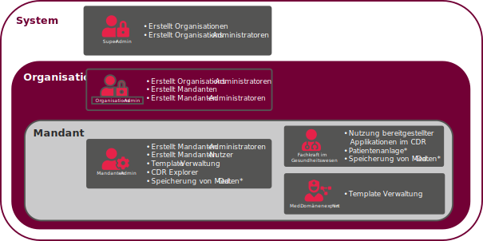

# System Components

The schematic diagram shows the individual system components and performance modules of the HIP CDR, which are briefly described below.

# Health Data Storage

Patient-related health data is stored in the HIP CDR using EHRbase. EHRbase is an open source platform for storing clinical data that is based on the openEHR specification and allows structured data to be stored based on standardized information models, as well as new information models (in the form of openEHR archetypes and templates) to be integrated at runtime. In this way, any structured, clinical data can be flexibly mapped without changing the underlying database schema. The models used are based on an international metamodel standard (ISO 13606-2) using the Archetype Definition Language.

The adaptability of the database is an essential feature of the system to ensure its extensibility and low maintenance for emerging data elements and requirements. New models can be loaded directly into the HIP CDR and EHRbase to receive, validate and persistently store data according to the openly defined information models and in accordance with the standard. New data models can be created and added by the client at any time.

The data models can be annotated with standardized terminologies to ensure semantic interoperability with the definitions of national and international standards. A link to customer-specific value lists (ValueSets) is also possible.

The data stored in EHRbase has a comprehensive (ATNA) audit trail and strict versioning. Clinical information is therefore not deleted during an update, but is supplemented with a new version. Old versions of clinical data are retained so that only new data sets can be written ("append only"); overwriting updates and deletions are not possible. The information about technical and human users who have made changes to data is also permanently stored.

As one of the important features, EHRbase implements the official openEHR REST API and the Archetype Query Language.

When transmitting data to EHRbase, various validation steps are carried out, such as the correct coding of data using terminologies, the presence of data elements, the use of standardized physical units and data types.

By storing the clinical data in an open standard and the open source license from EHRbase, maximum manufacturer neutrality is ensured. The client\'s administrators therefore have complete control, transparency and access to the entire database at all times.

# Data Storage for Administrative Data

HIP CDR enables separate storage of administrative data and personal health data. Administrative data can be personally identifying data such as demographic data (last name, first name, date of birth, place of birth, gender or contact address, etc.) as well as data on existing patient consents (consent), treatment appointments and details of individual treatment procedures.

the storage for administrative data is based on the HL7 FHIR standard (R4). An FHIR server allows read and write access to FHIR resources such as Person, Patient, Consent, Encounter and Episode of Care. The FHIR repository has integrated ID mapping so that different IDs of patients from different source systems are assigned to the correct person can be.

The storage for administrative data also uses the ATNA Audit Trail to log data changes and data access in accordance with data protection regulations (see above)

# Identity & Access Management

In order to integrate into the hospitals\' infrastructures, user data must be integrated. For this purpose, HIP CDR integrates the ID provider Keycloak.

Keycloak enables federation of user authentication from Active Directory and other common services and mapping to OAuth2 and OpenID Connect (OIDC). HIP CDR uses this approach for authentication and authorization in all services and allows the implementation of a cross-system single sign-on (SSO) using OIDC.

# Data Integration Engine (CDR Bridge)

HIP CDR provides an extensible data integration component, the CDR Bridge. The connection to the data-supplying systems takes place via so-called data connectors for various data formats and protocols (currently available: HL7 v2 and HL7 FHIR).

The assignment of the different formats for storing data in the HIP CDR is processed centrally in the system using configurable data mappings. Mappings are bidirectional and can be defined for both data import and data export.

An enrichment with terminology or mapping can also be implemented using the CDR Bridge. For this purpose, the internal FHIR terminology service can be used or an external terminology service can be connected, which makes terminologies available centrally and across applications.

The modular structure allows further integrations to be implemented into existing customer systems.

# Administration user interfaces (CDR Suite)

The CDR Suite represents the integrated user interface for managing the system and using many services. Among other things, the following actions are carried out via the CDR Suite: managing organizations and clients, managing system users and defining access roles and expanding and adapting data models (Template Management).

# Logging & Audit Trail

All writing data access to patient-related data is completely logged in the platform. The IHE integration profile Audit Trail and Node Authentication (ATNA) is used for this. To permanently store and provide event logs, the HIP CDR uses a dedicated repository for log data. in which all ATNA events can be stored and flexibly accessed via API.

This infrastructure is also used for technical system logs generated by the individual components of the HIP CDR architecture. These can be used as part of system maintenance and at the same time form the basis for reliable system monitoring

# Multi-Tenancy

HIP CDR offers the possibility of logically separating and managing data in a database.

Personal data collected by different responsible bodies or by one body for different purposes must be processed separately.

To ensure this, organizations and tenants can be set up according to the licensee\'s wishes.

- Organization: This is usually a larger group of clinics with a central IT department.
- Tenant: This can be a clinic, a group of clinics, a department or a ward.

# Authentication & Authorization

HIP CDR Suite uses a central ID provider (Keycloak) to authenticate and authorize all access to the system and interfaces. Management or roles is complemented by a role based access control system (RBAC) based on policies (written in XACML)

Users are not administered directly in the ID provider, but in the HIP CDR Suite user interface.

# Role management

Translating the provided rST content, including the table and notes, into Markdown:

## Scopes & Permissions matrix

As a default configuration, HIP CDR provides roles and permissions.

> **Note:** In a project environment, these roles and permissions will normally be adjusted to seamlessly integrate with local roles & permissions. The default roles can be understood as the minimum configuration to bootstrap HIP CDR.

**Abbreviations**: **C**= Create, **R**=Read, **U**=Update, **D**=Delete

| Scope                | Permission               | Super-Administrator | Organization-Administrator | Tenant Administrator | Medical Domain Expert | Healthcare Professional |
|----------------------|--------------------------|---------------------|----------------------------|----------------------|-----------------------|-------------------------|
| Organisations        | Organization             | CRUD                | -                          | -                    | -                     | -                       |
| Tenants              | Tenant                   | -                   | CRUD                       | -                    | -                     | -                       |
| Users                | Organization Administrator | CRUD             | CRUD                       | -                    | -                     | -                       |
|                      | Tenant Administrator     | -                   | CRUD                       | CRUD                 | -                     | -                       |
|                      | Medical Domain Expert    | -                   | CRUD                       | CRUD                 | -                     | -                       |
|                      | Healthcare Professional  | -                   | CRUD                       | CRUD                 | -                     | -                       |
| Apps                 | Administration Dashboard | -                   | -                          | R                    | -                     | -                       |
|                      | Show CDR Explorer        | -                   | -                          | CRD + render + metadata | -                 | -                       |
|                      | Patient Viewer           | -                   | -                          | x                    | -                     | R                       |
|                      | Template Management      | -                   | -                          | x                    | CRUD                 | -                       |

After purchasing a product license, your organization and one of your employees will be created as the first organization administrator.
