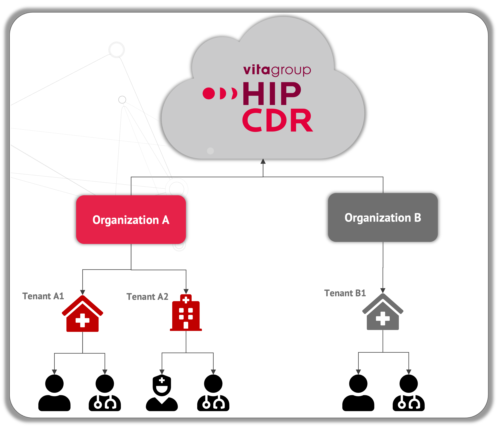
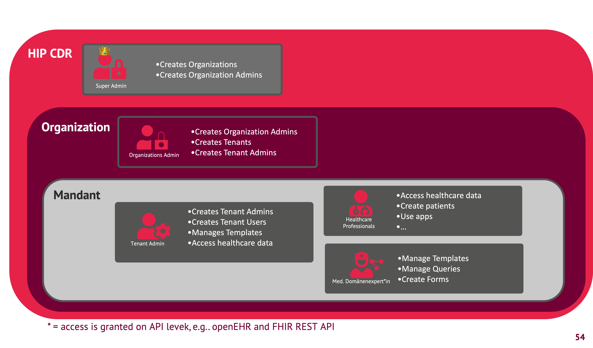

# Multi-Tenancy Capabilities

HIP CDR is multi-tenancy capable. Tenants are separting data by applying methods like Row-Level-Security and by using distinct schemas on the database level. Multi-Tenancy is implemented in the data storages (openEHR, FHIR, Binary) as well as CDR Suite and CDR Bridge.

Note that users are associated with exactly one tenant and you will need different users accounts for each tenant. Data and system configurations including templates and mappings are tenant-dependent. The following figure shows the hierarchical structure of the tenant management in HIP CDR.

*Organizations* provide a way to cluster tenants. Organizations can be created by users with the role **Super Admin** which are managed by vitagroup or authorized partners. Within Organizations, **Organization Admins** are resonsible for creating and managing tenants. Note that **Organization Admins** don't have any access on services on data for particular tenants. Once a tenant has been successfully created, a user with the role **Tenant Admin** can manage assets and users for her particular tenant.

For detailled information about how to create organizations, tenants and users, please see the CDR Suite documentation.

Following table provides a detailled view on the scopes and permission of the default roles:

**Abbreviations**: **C**= Create, **R**=Read, **U**=Update, **D**=Delete

| Scope                | Permission               | Super-Administrator | Organization-Administrator | Tenant Administrator | Medical Domain Expert | Healthcare Professional |
|----------------------|--------------------------|---------------------|----------------------------|----------------------|-----------------------|-------------------------|
| Organisations        | Organization             | CRUD                | -                          | -                    | -                     | -                       |
| Tenants              | Tenant                   | -                   | CRUD                       | -                    | -                     | -                       |
| Users                | Organization Administrator | CRUD             | CRUD                       | -                    | -                     | -                       |
|                      | Tenant Administrator     | -                   | CRUD                       | CRUD                 | -                     | -                       |
|                      | Medical Domain Expert    | -                   | CRUD                       | CRUD                 | -                     | -                       |
|                      | Healthcare Professional  | -                   | CRUD                       | CRUD                 | -                     | -                       |
| Apps                 | Administration Dashboard | -                   | -                          | R                    | -                     | -                       |
|                      | Show CDR Explorer        | -                   | -                          | CRD + render + metadata | -                 | -                       |
|                      | Patient Viewer           | -                   | -                          | x                    | -                     | R                       |
|                      | Template Management      | -                   | -                          | x                    | CRUD                 | -                       |

