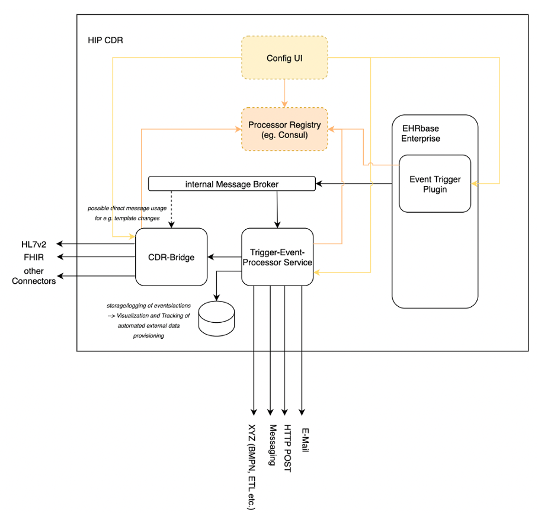

.. _plugin_system_event_trigger:

*********************
Event Trigger Plugin
*********************

For the implementation of diverse processes, HIP CDR has the possibility to create event triggers.
For this purpose, criteria can be flexibly defined and linked to actions.
For example, when new data is transferred to the platform, the system can automatically
check which type of examination is involved and whether a threshold value has been exceeded.
This function can be used to support the extraction of data for secondary use or to
asynchronously information systems about the creation of specific data points,
for example an order. For this purpose, the patient ID and selected values can
be send to a receiving system. It is also possible to create a rule to forward all
incoming data to an external data warehouse. By supporting http requests and Kafka messages,
different systems can be connected via event triggers

The event-trigger plugin allows to hook into composition creation/update. The hook is defined by an
event-trigger which can run before or after the internal database transaction has completed.

The plugin supports several mechanisms to propagate a event-trigger message.
    * HTTP
    * AMQP via RabbitMQ
    * Kafka
    * Java Logging

Parameters / Environment Variables
----------------------------------

.. list-table::
   :header-rows: 1
   :widths: 25 30 40 10

   * - Parameter
     - Env Variable
     - Usage
     - Example
   * - spring.rabbitmq.host
     - SPRING_RABBITMQ_HOST
     - RabbitMQ host address
     - 127.0.0.01
   * - spring.rabbitmq.port
     - SPRING_RABBITMQ_PORT
     - RabbitMQ host port
     - 5672
   * - spring.rabbitmq.username
     - SPRING_RABBITMQ_USERNAME
     - RabbitMQ Username
     - guest
   * - spring.rabbitmq.password
     - SPRING_RABBITMQ_PASSWORD
     - RabbitMQ Password
     - guest
   * - spring.rabbitmq.virtual-host
     - SPRING_RABBITMQ_VIRTUALHOST
     - RabbitMQ Virtual Host to use
     - /
   * - eventTrigger.kafka.activate
     - EVENTTRIGGER_KAFKA_ACTIVATE
     - Activate Support for Kafka
     - true
   * - spring.kafka.bootstrap-servers
     - SPRING_KAFKA_BOOTSTRAPSERVERS
     - Define Kafka Bootstrap Server
     - localhost:9092
   * - Eventtrigger.workers
     - EVENTTRIGGER_WORKERS
     - the number of executor pool workers to use when create / update events happen. Increasing the workers number means multiple triggers can be evaluated in parallel.
     - 8

Event Trigger REST API
----------------------

A REST API allows to manage Triggers using Create, Update and Delete operations.

Create Event Trigger
^^^^^^^^^^^^^^^^^^^^

.. http:post:: {{ehrbase-url}}/ehrbase/plugin/event-trigger/service

   Create an Event Trigger in CDR Base

   **Example request**:

   .. sourcecode:: http

      POST /ehrbase/plugin/event-trigger/service HTTP/1.1
      Host: localhost:8080
      Accept: application/json, text/javascript
      Content-Type: application/json

      {
          "id": "simple_test_trigger_bp.v1",
          "state": "active",
          "author": {
              "date": "2022-08-25T12:40:26.945Z",
              "name": "Alexandru Vidrean",
              "email": "alexandru.vidrean.ext@vitagroup.ag",
              "organisation": "VitaGroup AG"
          },
          "definition": {
              "mode": "AFTER",
              "rules": [
                  {
                      "diastolic": {
                          "when": {
                              "aql": "select e/ehr_id/value as ehr_id, c/uid/value as composition_id, o/data[at0001]/events[at0002]/data[at0003]/items[at0004]/value as diastolic from EHR e contains OBSERVATION o[openEHR-EHR-OBSERVATION.sample_blood_pressure.v1] AND COMPOSITION c where o/data[at0001]/events[at0002]/data[at0003]/items[at0004]/value/magnitude > 140"
                          },
                          "then": [
                              {
                                  "logEvent": {
                                      "command": "notify",
                                      "channel": "logger"
                                  }
                              },
                              {
                                  "amqpPublish": {
                                      "command": "publish",
                                      "channel": "amqp",
                                      "exchange": "demo-exchange",
                                      "routing-key": "*"
                                  }
                              },
                              {
                                  "httpPost": {
                                      "command": "notify",
                                      "channel": "http",
                                      "url": "http://localhost:1080/demo"
                                  }
                              }
                          ]
                      }
                  }
              ]
          }
      }

   **Example response**:

   .. sourcecode:: http

      HTTP/1.1 200 OK
      Vary: Accept

   :statuscode 200: no error
   :statuscode 500: internal system error

The following attributes need to be set inside the body of the HTTP request:

.. list-table:: Event Trigger Request Attributes
   :header-rows: 1
   :widths: 20 60 20

   * - Attribute
     - Meaning
     - Example
   * - ID
     - Identifier of the Event Trigger. It is recommended to follow semantic versioning.
     - blood_pressure_trigger.v1
   * - Language
     - Language of the event trigger
     - ISO_639-1::en
   * - State
     - Indicates if the event trigger is active or inactive. Inactive triggers will not be fired.
     - „active“ / „inactive“
   * - author
     - Information about the author of the event trigger. Note that the date needs to be provided explicitly by the client
     - “John Doe”
   * - Definition.mode
     - Indicates when the Event Trigger is fired. For now, Event Triggers in EHRbase can only be fired after the Transaction that stored the composition has finished successfully
     - AFTER
   * - Definition.rules
     - Provide one or more rules that are part of the Event Trigger logics
     - high_diastolic_pressure
   * - Definition.rules.{rulename}.when.aql
     - Provide an AQL query. The AQL query will only be executed on the single composition that just has been stored. Use the SELECT field to select the elements of interest (or objects or the whole composition) and the WHERE clause to define criteria. The Event Trigger will be executed if the result of the AQL query in non-empty.
     - “SELECT c/uid/value from COMPOSITION c CONTAINS OBSERVATION o[openEHR-EHR-OBSERVATION.blood_pressure.v2]”
   * - Definition.rules.{rulename}.then.notify
     - Attributes that are used for publishing a message using AMQP or HTTP
     -
       * RabbitMQ:

         - "“command"": ""publish"","
         - """channel"": ""amqp"","
         - """exchange"": ""etexchange"","
         - """routing-key"": ""et"""
       * Kafka:

         - """command"": ""publish"","
         - """channel"": ""kafka"","
         - """topic"": ""myTopic"""
       * HTTP:

         - """command"": ""notify"","
         - """channel"": ""http"","
         - """url"": ""https://ptsv2.com/t/bwn4g-1656672291/post"""
   * - Definition.rules.{rulename}.then.log
     - Attributes to define a logging event
     -
       * """command"": ""notify"","
       * """channel"": ""logger"""

Retrieve Event Trigger
^^^^^^^^^^^^^^^^^^^^^^

.. http:get:: {{ehrbase-url}}/ehrbase/plugin/event-trigger/service/{{event_trigger_id}}

   Retrieves an Event Trigger by providing its UUID.

   **Example request**:

   .. sourcecode:: http

      GET /ehrbase/plugin/event-trigger/service/3f2266c6-4eb2-47a3-9a83-6c7ace470fef HTTP/1.1
      Host: localhost:8080

   **Example response**:

   .. sourcecode:: http

      HTTP/1.1 200 OK
      Vary: Accept

      [
          {
              "uuid": "1bd0f5b8-ced1-4412-bde9-520cd82e41ba",
              "id": "test_trigger_bmlowgpddd.v0",
              "language": {
                  "original_language": "ISO_639-1::en"
              },
              "state": "active",
              "author": {
                  "date": null,
                  "name": "John Doe",
                  "email": "info@vitagroup.ag",
                  "organisation": "VitaGroup AG"
              },
              "definition": {
                  "mode": "AFTER",
                  "rules": [
                      {
                          "high diastolic": {
                              "when": {
                                  "aql": "select c/uid/value as diastolic from EHR e contains COMPOSITION c"
                              },
                              "then": [
                                  {
                                      "notify": {
                                          "command": "publish",
                                          "channel": "amqp",
                                          "exchange": "etexchange",
                                          "routing-key": "et"
                                      }
                                  },
                                  {
                                      "log": {
                                          "command": "notify",
                                          "channel": "logger"
                                      }
                                  }
                              ]
                          }
                      }
                  ],
                  "pre_condition": []
              }
          }
      ]

   :statuscode 200: Event Trigger was successfully activated / deactivated.
   :statuscode 404: No Event Trigger with given UUID was found.
   :statuscode 500: Internal system error.

Retrieve all Event Triggers
^^^^^^^^^^^^^^^^^^^^^^^^^^^

.. http:get:: {{ehrbase-url}}/ehrbase/plugin/event-trigger/service/

   Retrieves all Event Triggers

   **Example request**:

   .. sourcecode:: http

      GET /ehrbase/plugin/event-trigger/service/ HTTP/1.1
      Host: localhost:8080

   **Example response**:

   .. sourcecode:: http

      HTTP/1.1 200 OK
      Vary: Accept

      [
          {
              "uuid": "1bd0f5b8-ced1-4412-bde9-520cd82e41ba",
              "id": "test_trigger_bmlowgpddd.v0",
              "language": {
                  "original_language": "ISO_639-1::en"
              },
              "state": "active",
              "author": {
                  "date": null,
                  "name": "John Doe",
                  "email": "info@vitagroup.ag",
                  "organisation": "VitaGroup AG"
              },
              "definition": {
                  "mode": "AFTER",
                  "rules": [
                      {
                          "high diastolic": {
                              "when": {
                                  "aql": "select c/uid/value as diastolic from EHR e contains COMPOSITION c"
                              },
                              "then": [
                                  {
                                      "notify": {
                                          "command": "publish",
                                          "channel": "amqp",
                                          "exchange": "etexchange",
                                          "routing-key": "et"
                                      }
                                  },
                                  {
                                      "log": {
                                          "command": "notify",
                                          "channel": "logger"
                                      }
                                  }
                              ]
                          }
                      }
                  ],
                  "pre_condition": []
              }
          },
          {
              "uuid": "1bd0f5b8-ced1-4412-bde9-520cd82e41ba",
              "id": "test_trigger_bmlowgpddd.v0",
              "language": {
                  "original_language": "ISO_639-1::en"
              },
              "state": "active",
              "author": {
                  "date": null,
                  "name": "John Doe",
                  "email": "info@vitagroup.ag",
                  "organisation": "VitaGroup AG"
              },
              "definition": {
                  "mode": "AFTER",
                  "rules": [
                      {
                          "high diastolic": {
                              "when": {
                                  "aql": "select c/uid/value as diastolic from EHR e contains COMPOSITION c"
                              },
                              "then": [
                                  {
                                      "notify": {
                                          "command": "publish",
                                          "channel": "amqp",
                                          "exchange": "etexchange",
                                          "routing-key": "et"
                                      }
                                  },
                                  {
                                      "log": {
                                          "command": "notify",
                                          "channel": "logger"
                                      }
                                  }
                              ]
                          }
                      }
                  ],
                  "pre_condition": []
              }
          }
      ]

   :statuscode 200: Event Trigger was successfully activated / deactivated.
   :statuscode 404: No Event Trigger with given UUID was found.
   :statuscode 500: Internal system error.

Update Event Trigger
^^^^^^^^^^^^^^^^^^^^

.. http:put:: {{ehrbase-url}}/ehrbase/plugin/event-trigger/service/{{event_trigger_id}}

   Activates or deactives an event trigger based on the event-trigger uid

   **Example request**:

   .. sourcecode:: http

      PUT /ehrbase/plugin/event-trigger/service/3f2266c6-4eb2-47a3-9a83-6c7ace470fef?activate=false HTTP/1.1
      Host: localhost:8080

   **Example response**:

   .. sourcecode:: http

      HTTP/1.1 200 OK
      Vary: Accept

   :statuscode 200: Event Trigger was successfully activated / deactivated
   :statuscode 404: No Event Trigger with given uuid was found
   :statuscode 500: internal system error.

Delete Event Trigger
^^^^^^^^^^^^^^^^^^^^

.. http:delete:: {{ehrbase-url}}/ehrbase/plugin/event-trigger/service/{{event_trigger_id}}

   Deletes an event trigger based on the event-trigger uid

   **Example request**:

   .. sourcecode:: http

      DELETE /ehrbase/plugin/event-trigger/service/3f2266c6-4eb2-47a3-9a83-6c7ace470fef HTTP/1.1
      Host: localhost:8080

   **Example response**:

   .. sourcecode:: http

      HTTP/1.1 200 OK
      Vary: Accept

   :statuscode 200: Event Trigger was successfully deleted
   :statuscode 404: No Event Trigger with given uuid was found
   :statuscode 500: internal system error.
