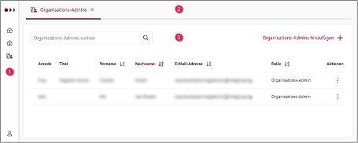
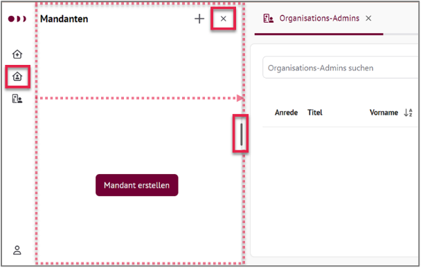
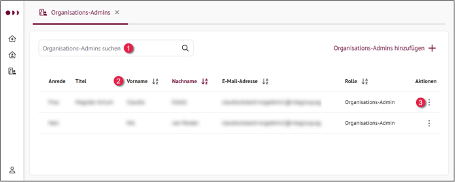
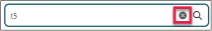
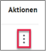
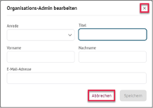
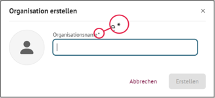

.. _cdr_suite_overview:

******************
CDR Suite Overview
******************

Purpose of Use
--------------

HIP CDR Suite is the central administration tool of the HIP CDR and, with its graphical interface, serves the following purposes:
* Creating organizations and users for organization administration
* Creating clients and users for client administration
* Creating client users with the roles Domain Expert and HealthCare Professional
* The import of medical models (openEHR templates) per client
* the overview and detailed presentation of the openEHR templates managed in the CDR
* the administrative view of the data managed in the CDR via the CDR Explorer component

Overview
--------

You will learn about the structure of the app using the HIP CDR Suite landing page.

.. note::
    The items you see in the sidebar menu depend on the role you sign in with.

    HIP CDR Suite: Landing page with collapsed navigation bar.

.. |three| image:: images/three.png
   :scale: 100%
   :align: middle

.. |nav_bar| replace:: **Navigation Bar:**
.. |tab_bar| replace:: **Tab Bar:**
.. |content_area| replace:: **Content Area:**
.. |expand| replace:: **Expand:**
.. |collapse| replace:: **Collapse:**

.. list-table::
   :name: Landing page with collapsed navigation bar
   :widths: 25 25 50
   :header-rows: 0

   * - |one|
     - |nav_bar|
        It allows you to switch between tasks or content and access the user account to log out of the HIP CDR Suite.

        |expand|
        By selecting a symbol, the navigation will be opened, for example B. there is no tenant yet.

        |collapse|
        By selecting a symbol, the navigation will be opened, for example B. there is no tenant yet.
     - |structure|
   * - |two|
     - |tab_bar|
     - Contains one or more tabs, e.g. B. Organization admins.
   * - |three|
     - |content_area|
     - Displays data, e.g. B. a list of organization administrators.

Following table shows and explains the symbols in the navigation bar.

.. list-table::
   :name: Navigation bar symbols
   :widths: 25 75
   :header-rows: 0

   * - |nav_hip_logo|
     - Product Logo
   * - |nav_org_symbol|
     - Organizations
   * - |nav_org_admin_symbol|
     - Organization Administrators
   * - |nav_tenants_symbol|
     - Tenants
   * - |nav_users_symbol|
     - Users
   * - |nav_dashboard_symbol|
     - Administrator Dashboard
   * - |nav_explorer_symbol|
     - CDR Explorer
   * - |nav_viewer_symbol|
     - Patient Data Viewer
   * - |nav_templates_symbol|
     - openEHR Templates Manager
   * - |nav_account_symbol|
     - User Account

Lists, entries and context menu
-------------------------------

    List with search field and context menu.

.. |search| replace:: **Search and filter:**
.. |sort| replace:: **Sort entries:**
.. |context| replace:: **Context menu:**

.. list-table:: Lists and entries
   :name: bla
   :widths: 25 75
   :header-rows: 0

   * - |one|
     - |search|
       By clicking on the magnifying glass symbol or in the search field you can enter one or more search terms.
       As soon as the second character is entered, the list is automatically searched in all columns and the list
       is automatically filtered.

       Reset filter: Selecting the X symbol cancels the action. The list is displayed again unfiltered
       with all entries.

       |search_bar|
   * - |two|
     - |sort|
       Entries can be sorted ascending or descending with one click. Example:

       |sort_button|

       allows alphabetical sorting by last name.
   * - |three|
     - |context|

       To make entries, for example to edit or delete, use the context menu.

       |context_menu|

Cancel actions
---------------

You can cancel almost every action in the HIP CDR Suite. That means:
*Data is not changed or
*Data that has already been entered will be discarded or not saved.

In the Search context
^^^^^^^^^^^^^^^^^^^^^

See :numref:`test<Lists and entries>` for reference.

In Elements like tabs or dialogues
^^^^^^^^^^^^^^^^^^^^^^^^^^^^^^^^^^

Selecting the X symbol or the Cancel button closes the element; entries are not saved.

Mandatory fields
----------------

Mandatory fields are marked with an asterisk *.

